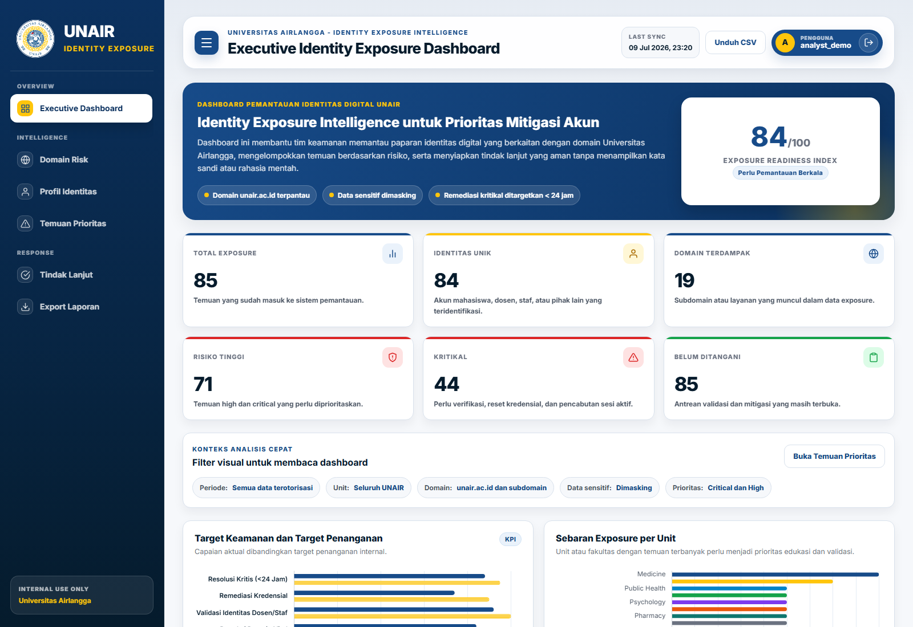

# UNAIR Identity Exposure Intelligence Dashboard

<p align="center">
  Defensive security dashboard for monitoring, triaging, and remediating sanitized identity exposure findings across Universitas Airlangga digital assets.
</p>

<p align="center">
  
  
  
  
  
</p>



## Overview

This project is a defensive security workspace built for **Universitas Airlangga** to help review identity exposure signals associated with `unair.ac.id` and related subdomains. It is designed for academic demo and controlled internal validation use, with a strong emphasis on **sanitized evidence**, **risk prioritization**, and **remediation tracking**.

The current implementation uses a **synthetic dummy dataset** until an authorized real dataset is available. Raw passwords, cookies, tokens, and other secrets are not displayed in the interface or export output.

## Core Capabilities

- Executive overview for exposure volume, critical findings, impacted domains, and remediation readiness.
- Domain intelligence view for `unair.ac.id` and related subdomains.
- Identity exposure profiling with safe masking and lightweight matching.
- Risk scoring and prioritization for high-risk and critical findings.
- Remediation tracker with status workflow and audit logging.
- Sanitized CSV export for reporting without exposing raw secrets.
- Role-based access foundation using Django authentication groups.

## System Architecture / Stack

| Layer | Implementation |
| --- | --- |
| Backend | Django 5 |
| Database | PostgreSQL 16 via Docker Compose, SQLite fallback for local development |
| App Server | Gunicorn |
| Static Delivery | WhiteNoise |
| Frontend | Django Templates, HTML, CSS, vanilla JavaScript, Chart.js |
| Data Pipeline | Management commands for seeding, importing, and rescoring exposure data |

## Quick Start

### Docker Compose

```bash
copy .env.example .env
docker compose up --build
```

In another terminal:

```bash
docker compose exec web python manage.py seed_dummy_data --reset --create-demo-users
```

Open `http://localhost:8000`.

### Local Development

```powershell
Copy-Item .env.example .env
.\.venv\Scripts\Activate.ps1
$env:POSTGRES_HOST=""
python manage.py migrate
python manage.py seed_dummy_data --reset --create-demo-users
python manage.py runserver 127.0.0.1:8000
```

## Demo Access

Demo users are created by the seed/setup commands:

- `admin_demo`
- `analyst_demo`
- `reviewer_demo`

Default demo password:

```text
ChangeMe123!
```

## Management Commands

```bash
python manage.py seed_dummy_data
python manage.py import_exposures data/dummy_exposures.csv --source authorized-sample --reset
python manage.py recompute_risk_scores
python manage.py setup_roles --create-demo-users
```

Minimum accepted CSV columns:

```text
source_id,observed_at,url,username,email,exposure_types,password_present,cookie_present,token_present,source_label,unit_hint
```

Only `unair.ac.id` and valid subdomains are imported. Non-UNAIR rows are skipped.

## Data Safety

- The current dataset is synthetic and intended for demo, validation, and UI development.
- Raw passwords, cookies, tokens, and secrets must not be stored or presented in plain form.
- Identity evidence is masked or reduced to safe indicators before rendering and export.
- Real exposure data should only be processed from authorized sources and under institutional approval.

## Project Structure

```text
.
|-- config/                 Django project configuration
|-- exposures/              Models, views, services, commands, and tests
|-- templates/              Dashboard and authentication templates
|-- static/                 CSS, JS, and UNAIR branding assets
|-- data/                   Dummy CSV source data
|-- docs/                   Supporting project documentation
|-- docker-compose.yml      Container orchestration
|-- Dockerfile              App container build
`-- README.md
```

## Documentation

- [Data Dictionary](docs/data-dictionary.md)
- [Handover Notes](docs/handover.md)
- [UI Redesign Summary](docs/ui-redesign-summary.md)

## Test Coverage

Current automated coverage includes:

- domain filtering and normalization
- masking behavior
- dummy import and deduplication
- skipping non-UNAIR rows
- login requirement on protected views
- remediation audit logging
- sanitized CSV export checks

Run tests with:

```bash
python manage.py test
```
